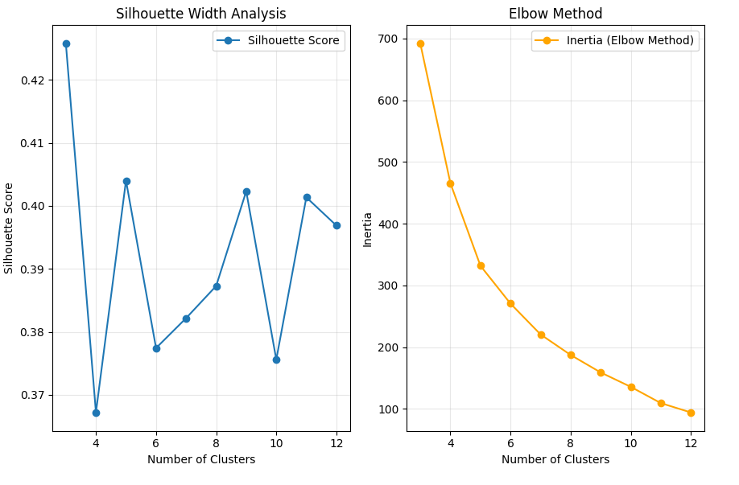
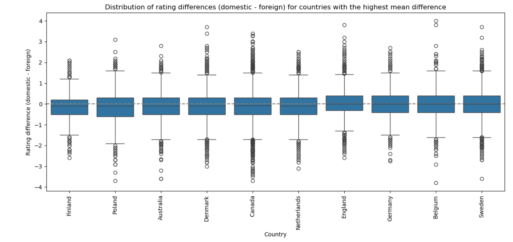

# Selective Sips: Cultural and bias trends in beer preferences across countries
## _by DataPilots_

##  Introduction
### Goal of the analysis
Taste preferences for food and drinks often go beyond the intrinsic characteristics of the items themselves and are in reality shaped by various external influences. Cultural differences are a prime example: while highly spiced dishes are popular in many South Asian countries, milder flavors are often preferred in Western Europe. Our project examined similar external factors that shape beer preferences, aiming to uncover what truly drives an individual’s taste in beers. We analyzed how different beer characteristics are appreciated across selected countries and assessed whether users from certain countries are more generous in their ratings compared to users from other countries. We also evaluated whether the origin of a beer biases the ratings it receives. Additionally, we investigated how seasonal variations impact the enjoyment of specific beer categories, and how user rating tendencies evolve as they gain experience. By identifying these “external” influences, we hoped to help beer enthusiasts better understand their preferences and make choices based more on intrinsic qualities, ultimately improving their sensory experience and enjoyment of beer.

### Dataset
The dataset for our analysis comprised beer reviews collected from two popular beer rating platforms, BeerAdvocate and RateBeer, covering a period from 2001 to 2017. For each website, the dataset included metadata on reviewers, beers, and breweries, along with detailed user reviews. In total, there were records of over 500,000 unique beers produced by breweries in more than 200 countries. Among the most frequently reviewed beer styles were American IPA and India Pale Ale. The dataset also included approximately 200,000 users from over 200 countries, though the distribution of users and breweries was heavily skewed: the vast majority were located in the United States on both platforms. Overall, the dataset contained over 8 million reviews from BeerAdvocate and 7 million from RateBeer. For the parts of our analysis that involved country comparisons, we excluded reviews from countries with fewer than 50 reviewers to ensure that the data was representative at a national level.

##  Cultural influence on beer preferences
We decided to start our analysis by investigating how the origin of reviewers influences their appreciation of beers. Specifically, we aimed to explore the cultural impact on beer appreciation by investigating qualitative aspects, such as beer style preferences across countries, and quantitative aspects, such as the significance of various beer attributes in influencing the final rating across different regions.

### Beer style preferences
_How do beer style preferences differ between countries, and are these regional preferences stable over time?_

We began our analysis by trying to apprehend global beer preferences by examining both the number and the average ratings of various beer styles across countries. After grouping countries into geographic subregions and applying principal component analysis, we used clustering techniques to identify groups of countries that share similar beer style profiles. Initially, we focused on the number of ratings per beer style, and later we incorporated average ratings to enhance our understanding. We aimed to determine whether countries form distinct clusters of beer preferences, or whether beer styles and tastes evolve along a more continuous spectrum. 

Additionally, we used the time information in reviews to determine if beer style preferences in the identified clusters remain stable over time — supporting the hypothesis that they are influenced by culture — or if they fluctuate, suggesting other contributing factors.

#### **Initial analysis**
Before conducting the analysis described above, we first familiarized ourselves with the data by examining the number of reviews for different beers and beer styles across all countries combined.

The word cloud maps and histograms show the distribution of the number of ratings of popular beer brands and styles across the world based on combined BeerAdvocate and RateBeer data. The left plot revealed the beers that received the most ratings, namely "Arrogant bastard ale" and "Founders breakfast stout", which received about 15 thousand ratings each. Many other beers received between 14 thousand and 9 thousand ratings.

The right plot revealed that the distribution of the number of ratings for different beer styles was skewed, with specific beer styles dominating in popularity. "American IPA" lead with over 800,000 ratings, followed by "Imperial IPA" at around 700,000 ratings. Other styles like "Imperial Stout" and "India Pale Ale" also feature prominently, with over 500,000 ratings each.

#### **Clustering using the number of ratings per beer style as features**

We started by visualizing the number of ratings for different beer styles across different countries. In the corresponding 3D scatter plot (shown below), we used logarithmic scaling for the number of ratings due to the skewed distribution of the number of ratings across countries, with the US having significantly more ratings than other countries. We then used PCA to visualize the data in 2 dimensions. Before applying PCA to the data, we grouped countries into geographic regions based on United Nations geographical subregions. This grouping was done to simplify the clustering process and help the algorithm identify meaningful patterns more effectively. The PCA plot is shown below.

We then applied K-means to the resulting 2D representation of the data in order to see if certain countries clustered together in terms of number of ratings across beer styles. To do so, we had to determine the optimal number of clusters to specify to the clustering algorithm. To achieve this, we used silhouette width analysis and the elbow method. The outputs of these methods is shown below.

In the right plot, the 'elbow' of the curve seems to occur at n=5, and in the left plot, n=5 is associated with the second-highest silhouette score. This led us to choose n=5 for the number of clusters. We thus applied K-means to try to find 5 clusters in the 2D PCA representation of the data, and obtained the results below.

The top plot shows the clusters found by K-means, and the bottom plot shows the contribution of each beer style to each of the 2 PCA components. The absolute height of a bar represents the strength of the contribution of the beer style to the corresponding principal component. We can see that Sour and Saison have the highest contributions to PC1, and that American IPA and Farmhouse Ale have the highest contributions to PC2. This means that these beers play a more prominent role in shaping the data variability. It is also worth noting that the identified clusters are not visually well-defined, indicating that countries may exist on a continuous spectrum of beer preferences rather than being divided into clearly distinct groups.

In order to characterize beer preferences in the clustered regions, for each of the five clusters, we plotted the plots below, which reveal the 5 most frequently reviewed beer styles for each cluster. The y axis is the average number of ratings of the beer styles across countries of the cluster.

We can see that countries from cluster 1, namely the United States and Canada, stand out due to their frequent rating of American IPA and Imperial IPA beers. Countries from cluster 3, which include Denmark, Norway, and Poland display a preference for traditional styles like Pale Lager, Imperial Stout and Bitter. In cluster 0, including countries like Slovakia and Latvia, IPA stands out as the most frequently reviewed beer style, followed by Pale Lager and Belgian Strong Ale. 

#### **Evolution of regional beer style preferences over time**

To gain a deeper understanding of beer preferences within the identified clusters, we analyzed the numerical ratings of the most frequently reviewed beers in each cluster and examined their evolution over time specifically within the countries belonging to the respective clusters. Results are shown in the plots below.

We observe that the average ratings of the most frequently beer style in a given cluster remain relatively stable over time in that cluster, suggesting stable regional preferences. We can also observe similar rating patterns across clusters: for instance, Pale Lager consistently receives low ratings in clusters 0 and 2 to 4, whereas Imperial Stout consistently receives high ratings in clusters 0, 3 and 4. This suggest shared preferences among regions in different clusters.

We then focused on the USA and Canada, which were grouped together in cluster 1. We aimed to determine whether their clustering reflected genuinely similar preferences or was influenced by external factors, such as our pre-defined regional grouping before PCA, which could have introduced bias, or their shared characteristic of having significantly more ratings than other countries. To investigate this, we plotted the evolution of average ratings over time for two distinctly different beer styles—American IPA and Pale Lager—in both countries to assess whether their trends showed genuine similarity.

The above plot shows that the evolution of the average rating of both beer styles is extremely similar in the 2 countries. American IPA consistently receives high and stable ratings in both contries, uggesting a steady but not noticeably increasing interest. Interestingly, Pale Lager ratings in these two countries appear to increase over time. This suggests an evolution in taste over time, perhaps driven by global beer trends and expanding market availability (since Pale Lager is a European beer style). Overall, the similar evolution of ratings of both beer styles in the US and in Canada suggests that their clustering may actually reflect genuinely similar preferences.

#### **Including average ratings per beer style as features for clustering**

Building on the previous analysis, we decided to repeat the clustering of countries, this time incorporating the average ratings for each beer style as additional features. This approach aimed to explore whether including ratings would yield different results. We also reasoned that using average ratings would provide a more accurate representation of beer preferences, as the number of ratings per beer style could be influenced by external factors, such as availability, rather than true preference. We performed the same procedure, grouping countries into geographic regions, performing PCA, and performing K-means with an optimal number of clusters. The results are shown in the plots below.

This updated clustering identified 7 clusters. We observe that the United States forms its own cluster (cluster 6) characterized by its high reviewing frequency of American and Imperial IPA styles. We can note that the non-U.S. clusters feature similar sets of frequently rated beer styles, with IPA being by far the most frequently reviewed beer style for nearly all clusters, suggesting that they may be more alike than distinct. This idea is supported by the fact that in the PCA plot, clusters are not always well-defined or mutually exclusive.

 In this way, compared to the initial analysis, this refined approach defines more subtle cluster boundaries and highlights the interplay between popularity and appreciation, resulting in a richer and more accurate representation of worldwide beer tastes. However, it appears that many countries share overlapping beer preferences rather than fitting neatly into isolated groups.

Finally, for each cluster, we examined the evolution of the average rating of the most frequently reviewed beers for that cluster within the countries belonging to that cluster.

For most clusters, the average ratings of the most frequently reviewed beer styles remain relatively stable, indicating consistent preferences. The higher variability in average ratings observed for clusters 1 and 2 may be due to the fact that there were fewer reviews from the corresponding countries in the dataset. 

We can observe that the non-US clusters show similar rating tendencies: for instance, for these clusters, IPA and American Pale Ale always oscillate around 3.5, Imperial stout around 4 and Pale lager around 2. This reinforces the idea that these clusters may not be significantly distinct.

#### **Conclusion beer style preferences**
Overall, even though our analyses, especially the first one, reveal interesting regional beer style preferences, our attempt to cluster countries based on beer ratings, using the number of reviews and the average rating for different beer styles as features, did not allow us to identify clearly distinct groups of countries. While the United States stood out as a unique cluster due to its distinct preferences, other non-U.S. clusters were less clearly separated and shared similar rating tendencies. A possible cause may be the skewness of the distribution of reviewer locations in the dataset: the vast majority of reviewers came either from the United States or from Europe. This may have have constrained the analysis and limited the number of meaningfully distinct clusters that could be identified.

### Importance of specific beer attributes
_Does the significance of specific beer attributes in determining one’s liking of a given beer vary by country?_

After looking at how different beer styles are liked in different countries, we decided to explore how the different sensory characteristics of beers affect how much people enjoy them. We started by analyzing this across all countries together and then focused on different regions to see if there were any differences.

#### **Preliminary analysis**

Before starting to implement our analysis, we verified compatibility of the rating systems for beer attributes across the two datasets. This enabled us to realize that taste and aroma were rated out of 5 in BeerAdvocate but out of 10 in RateBeer, as shown in the histograms below showing the distribution of attribute ratings in the 2 platforms. We overcame this issue by scaling. 

From the histograms, we noticed that ratings from RateBeer were generally slightly lower compared to those from BeerAdvocate. Additionally, the rating system on RateBeer appeared more restrictive, allowing only 0.5-point increments, whereas BeerAdvocate allowed more precise ratings with finer increments.

We then examined the number of reviews available from each country, as shown in the bar plot below. Countries with fewer than 50 reviewers were excluded, and the USA was omitted from the plot due to its significantly higher number of reviewers, which would disrupt the plot’s uniformity. This plot was an important reference throughout our analysis, as the amount of data available directly influences the reliability and depth of country-specific insights. This plot confirmed that the distribution of reviewer locations was heavily skewed, with a lot of reviews from North America and certain European countries and significantly less reviews for the rest of the world.

Since we planned to use attribute ratings as independent variables in a linear regression model, as explained later, we also decided to examine the collinearity between attribute ratings. We visualized these relationships in the heatmap below., which was created based on the data from both platforms.

After examining the matrix, we observed that appearance appeared to be more distinct compared to other attributes, as its correlation values were notably moderate across the datasets. In contrast, we identified high correlation values between certain attributes, particularly aroma and taste, which suggested the potential presence of multicollinearity. Drawing on these insights, we developed a linear regression function with built-in utilities to detect and mitigate collinearity issues if they occurred.

Our plan moving forward was to divide the analysis into two parts: first, a global linear analysis to evaluate the overall importance of each attribute in determining final beer ratings, and second, a region-specific analysis to identify any variations across geographic regions.

#### **Linear regression analysis on all countries combined**
Our linear regression model featured the following variables:
- **Dependent variable**: Final Beer Rating  
- **Independent variables**:  
   - x1= Appearance
   - x2= Aroma
   - x3= Palate
   - x4= Taste
   - x5= Brewery's Average Rating  
   - x6= Style's Average Rating
We included brewery average rating and beer style average rating as potential confounders to help isolate the effect of attribute ratings on the final beer rating.

**OLS Regression Results**

| Dep. Variable:           | rating         | R-squared:          | 0.970           |
|--------------------------|----------------|---------------------|------------------|
| Model:                   | OLS            | Adj. R-squared:     | 0.970           |
| Method:                  | Least Squares  | F-statistic:        | 4.513e+07       |
| Date:                    | Fri, 20 Dec 2024 | Prob (F-statistic): | 0.00            |
| Time:                    | 04:09:48       | Log-Likelihood:     | 5.6712e+06      |
| No. Observations:        | 8325434        | AIC:                | -1.134e+07      |
| Df Residuals:            | 8325427        | BIC:                | -1.134e+07      |
| Df Model:                | 6              |                     |                 |
| Covariance Type:         | nonrobust      |                     |                 |

|                 | coef     | std err    | t         | P>t   | 0.025     | 0.975     |
|-----------------|----------|------------|-----------|-------|-----------|-----------|
| const           | 3.5296   | 4.24e-05   | 8.32e+04  | 0.000 | 3.530     | 3.530     |
| x1              | 0.0769   | 5.78e-05   | 1330.489  | 0.000 | 0.077     | 0.077     |
| x2              | 0.2115   | 8.08e-05   | 2618.000  | 0.000 | 0.211     | 0.212     |
| x3              | 0.1165   | 6.81e-05   | 1710.368  | 0.000 | 0.116     | 0.117     |
| x4              | 0.3558   | 8.54e-05   | 4168.911  | 0.000 | 0.356     | 0.356     |
| x5              | 0.0157   | 7.29e-05   | 215.683   | 0.000 | 0.016     | 0.016     |
| x6              | 0.0004   | 7.02e-05   | 5.178     | 0.000 | 0.000     | 0.001     |

Notes:
[1] Standard Errors assume that the covariance matrix of the errors is correctly specified.
Training MSE: 0.014991810801546554 Training R2: 0.9701682103394674 Training Pearson Correlation: 0.984971172339306
Testing MSE: 0.015048324437271856 Testing R2: 0.9700590232120285 Testing Pearson Correlation: 0.9849157450753232

Linear regression analysis of the total dataset showed us that the model provided nearly perfect fit to the data, since the R squared values for both the training and testing data were 0.97. These values indicated that 97% of the variance in the final beer ratings could be explained by the the beer attributes as well as the confounding variables, namely brewery average rating and beer style average rating. The low training and testing MSE showed that the model could produce accurate predictions. The residual plots showed symmetric distribution, indicating no systematic bias. The actual vs predicted plots for both the training and test datasets  demonstrated strong predictive accuracy with a strong alignment of the data along the y = x line. 

All coefficients had an extremely small p-value, indicating that all independent variables were useful in explaining variability in final beer ratings. The value of the coefficients highlighted the relative importance of different beer attributes: taste (0.356) had the most importance followed by aroma (0.2115),palate (0.1164) and finally appearence (0.0769). Brewery reputation (0.0157) had subtle  but noticeable influence, while the effect of beer style (0.0004) was minimal. We were able to perform such comparisons because we had scaled the independent variables prior to performing the regression.

The bar plot below illustrates how the different beer attributes compare in their influence on ratings, highlighting the dominance of taste as a key factor in beer ratings.

In conclusion, the model provided solid insights into factors influencing beer ratings, confirming taste as the dominant attribute.

**Comparison of results across different types of regression**

| Attribute                  | Linear Regression | Lasso Regression | Ridge Regression |
|----------------------------|-------------------|------------------|------------------|
| Appearance (x1)            | 0.076925          | 0.076894         | 0.076925         |
| Aroma (x2)                 | 0.211487          | 0.211559         | 0.211487         |
| Palate (x3)                | 0.116545          | 0.116521         | 0.116545         |
| Taste (x4)                 | 0.355850          | 0.355793         | 0.355850         |
| Brewery Avg. Rating (x5)   | 0.015719          | 0.015668         | 0.015719         |
| Beer Avg. Rating (x6)      | 0.000364          | 0.000320         | 0.000364         |

Motivated by the observed correlation between certain beer attributes in the preliminary analysis, we applied Lasso and Ridge regularization techniques to address potential multicollinearity among the predictor variables. These methods extend standard linear regression by adding penalties to the coefficients, which help mitigate both multicollinearity and overfitting. A comparison of the results showed that multicollinearity was not a significant concern, as the coefficients obtained from standard linear regression, Lasso, and Ridge were nearly identical. As shown in the table, the consistency across these methods highlights the reliability of the linear regression model and the stability of the attribute coefficients.

#### **Region-specific linear regression analysis**

We then performef the same linear regression analysis but for each country in the dataset to investigate how beer attributes influence ratings in different countries. The boxplots below shown the distribution of the linear regression coefficients across all contries.

As shown in the above plot, taste consistently emerged as the most influential factor across countries, with the boxplot highlighting its dominance through the highest median value compared to other attributes. The relatively wide interquartile range for this coefficient indicated country-specific differences in the importance placed on taste. Aroma consistently ranked second, with more tightly clustered coefficients, indicating general agreement on its significance. Palate and appearance contributed less prominently, with regional variations suggesting some countries value visual or texture-related qualities more (in relative to other countries).Regarding the control variables, brewery reputation showed moderate influence, highlighting its subtle role in shaping perceptions but remaining secondary to core beer qualities. Style rating had the least impact, suggesting users prioritize sensory attributes like taste and aroma over beer style classifications.

 

We then grouped countries into geographical regions to analyze if the importance of the different beer attributes exhibit regional variations. Taste consistently held the highest coefficient across all regions, with aroma, palate, and appearance following it in the same order as identified when considering all countries together. Western Europe and North America showed tight clustering of coefficients, while Latin America and Eastern Asia displayed larger variance. This may reflect the fact that the dataset had much more data from  Western Europe and North America compared to other regions, rather than genuine preference differences. Style and brewery ratings consistently had the smallest coefficients across all regions, reflecting their secondary role in evaluations.

#### **Conclusion of specific beer attributes**
Our analysis revealed a consistent global ranking of beer attributes in terms of importance, with regional variations likely influenced by sample size and the distribution of reviewer locations in the dataset. While there were minor deviations between countries, the overall order of attribute importance in determining final beer ratings remained stable, with taste consistently emerging as the most dominant factor. This consistency suggests a global consensus on the relative significance of beer attributes.

##  Location-related biases in ratings
After exploring how beer preferences differ across countries, we aimed to identify factors—beyond the intrinsic qualities of beer—that might influence user ratings. Our initial focus was on location-related biases, as these seemed the most likely to impact beer ratings.

### Cultural biases
_Are users from certain countries more generous or more critical in their ratings compared to users from other countries?_

Our first step was to investigate whether users from certain countries are more generous or more critical in their ratings compared to users from other countries. 

#### **Logistic regression**
To this aim, we started by fitting a logistic regression model on a sample (due to the significant size of the dataset) of reviews from BeerAdvocate and RateBeer,where the dependent variable was the reviewer’s country, and the independent variables were potentially relevant confounders, namely the average rating for the beer style, the brewery's average rating and the number of reviews given by the user. The model gave a propensity score to each review, which corresponded to the likelihood of a review being associated with a particular country given the confounders.
 
We used these propensity scores to match individual reviews from reviewers in one country with reviews from reviewers in another country that have similar propensity scores. This matching ensured that the paired reviews were comparable in terms of confounders, so that any differences in ratings could be attributable to the reviewer’s country rather than other factors. 

#### **Paired analysis**
To be able to determine whether users from certain countries are more generous or more critical in their ratings compared to users from other countries, we compared paired rating differences between all pairs of user location. To do so, we grouped the matched reviews by country pairs and performed a paired t-test for each group to test whether the mean difference in ratings was significantly different from zero. We only considered country pairs with at least 20 matched reviews. We then plotted the obtained p_values for each country pair to see if there were some significant differences in final beer ratings for some country pairs at a 5% significance level. The results are shown in the plot below.

As shown by the small number of data points in the plot, few country pairs had enough matches to be included in the analysis.

The colored dots below the y=0.05 line indicate that there were some country pairs for which there was a significant difference in final rating at a 5% significance level.For instance, we can see in the plot that after accounting for confounders, users from Finland tend to give ratings that are significantly lower than users from the Puerto Rico from a statistical standpoint. On the other hand, users from Russia tend to give ratings that are significantly higher than users from Wales from a statistical standpoint. These results suggested that users from certain regions tend to be more generous or more critical in their ratings compared to users from other countries.

In this way, some of the differences were statistically significant. However, statisticals significance does not imply practical significance. In order to determine if these differences were also meaningful from a practical standpoint, we decided to look at their magnitude. We plotted a boxplot to visualize the distribution of differences in final beer rating between matched reviews for the 10 country pairs for which the t-test yielded the lowest p-values. We obtained the figure below.

In the plot, few boxes contain zero (zero is not comprised between Q1 and Q3), which indicates that for most of the top 10 country pairs with the lowest p-values, ratings from one country are consistently higher or lower than those from the other country for most paired reviews in the sample. This implies that the majority of matched reviews for most of of these country pairs show a meaningful and unidirectional difference in ratings. In addition, the median for some country pairs is larger than 1 in absolute value. A difference of 1 out of 5 is large, which means that for these country pairs, the differences in ratings are not only statistically significant but also meaningful from a practical standpoint.

#### **Conclusion cultural bias**
These results suggested that, after accounting for potential confounders, users from certain countries appear more generous in their ratings compared to users from other countries. There seemed to be clear trends in rating differences for certain country pairs, and the differences in ratings appeared significant from both a statistical and practical standpoint for these pairs. These findings align with the hypothesis that a "cultural bias" might influence beer reviewers, potentially impacting beer ratings.

However, the matching process did not yield sufficient matches for all countries, which restricted our ability to make meaningful comparisons across a broader range of country pairs. In addition, a significant bias was only observed for some specific country pairs, meaning the results did not support the conclusion that this bias is a general or universal phenomenon. These observations highlighted the need for further investigation to clarify the role of cultural biases in beer ratings.

### Beer origin bias
_Do users show a bias by rating domestic beers higher than foreign ones?_
In countries with strong beer traditions, local beers often carry national pride. This phenomenon led us to think that the origin of a beer may bias beer ratings, with users rate domestic beers more favourably than foreign ones. This consideration motivated us to investigate whether users rate domestic beers higher than foreign ones.

#### **Matched analysis**
To achieve this, we began by labeling each review as either domestic (reviewing a beer produced in the reviewer’s country) or foreign. Next, we matched domestic and foreign beer reviews written by the same user. To control for the influence of beer style on ratings, we ensured that matched reviews were for the same beer style.

We subsequently performed a paired t-test to determine whether the mean difference in ratings between matched reviews was significantly different from zero. The test yielded an extremely small p-value, suggesting that the mean difference in final rating between matched domestic and foreign reviews was significantly different from zero. Moreover, the test statistic was negative. This result contradicted our initial hypothesis, as it implied that on average, domestic reviews were associated with _lower_ ratings than matched foreign reviews. 

Before drawing any conclusions, we plotted a histogram of rating differences between matched reviews to examine their distribution and magnitude, allowing us to evaluate their practical significance. The obtained figure is shown below.

As shown in the plot, the distribution of rating differences between matched domestic and foreign reviews was approximately symmetrical and centered around zero. The distribution was bell-shaped, with fewer data points with a rating difference farther from zero, and nearly no data points with a rating difference larger than 2. This implied that there was no clear trend in rating differences between matched domestic and foreign reviews. Additionaly, the mean rating difference between matched reviews was very small (-0.03). In this way, the difference between ratings of matched domestic and foreign reviews did not appear to be significant from a practical standpoint. We reasoned that the statistical significance identified by the t-test might be attributed to the large number of matched reviews, which can make even minor differences appear statistically significant.

We then decided to examine the distribution of rating differences between matched reviews for different countries separately to determine if certain countries exhibited a bias that was not apparent when analyzing all countries combined. We looked at the 10 countries with the highest mean difference between matched reviews among the countries with matched reviews from at least 100 different reviewers to ensure results were representative. We obtained the following boxplots:

As shown in the plot, even for the 10 countries with the highest mean rating difference between matched reviews, the distribution of rating differences was centered around zero. For each of these 10 countries, the whiskers and outliers (circles) showed a roughly balanced number of positive and negative extreme values, suggesting that there was no strong skew in the rating differences. These results showed that even when looking at individual countries, there did not seem to be a particular rating bias related to whether the reviewed beer was from the same country or a different country than the reviewer.

We then decided to focus only on matched reviews from beer enthusiasts, which correspond to users who wrote a significant number of reviews. Intuitively, we expecteded beer enthusiasts to be less sensitive to factors that are not related to the instrinsic qualities of a beer. Hence, we did not expect differences between pairs of matched reviews to be significant, especially since we had observed that these differences were not practically significant when looking at all reviewers together. In our analysis, we considered that a beer enthusiast was a reviewer who had written at least 50 reviews. 

We performed the same analysis, starting with a t-test to compare ratings between matched domestic and foreign reviews from beer enthusiasts. Once again, we obtained a very small p-value and a counter-intuitive negative test statistic, prompting us to plot a histogram of rating differences between matched reviews to better understand their distribution and magnitude. We obtained a very similar histogram to the one obtained when looking at all users:

The distribution was again bell-shaped, approximately symmetrical and centered around zero, with a very small mean value. This implied that there was no evident pattern in the rating differences between matched domestic and foreign reviews from beer enthusiasts. The data thus appeared consistent with our hypothesis that beer enthusiasts are not influenced by the origin of beers in their ratings.

We also visualized the distribution of rating differences between matched reviews from beer enthusiasts for different countries separately, adopting the same approach as for the analysis on all reviewers. As shown below, we obtained a very similar plot, suggesting that even when analyzing individual countries, there did not seem to be clear evidence of a rating bias among beer enthusiasts based on whether the beer being reviewed is domestic or foreign.

#### **Conclusion beer origin bias**
These results indicate that a beer's status as domestic or foreign to the user does not appear to influence their ratings. This was expected for beer enthusiasts, but our findings suggested that this holds true when considering all users together.

##  Other biases
After examining cultural and origin-based biases in beer ratings, we turned our attention to other external factors unrelated to location. Using the time data available in reviews, we analyzed two such factors: the season during which the beer was reviewed and the user’s experience level.

### Seasonal biases
_Do seasonal changes affect how different beer styles are rated?_

We first decided to investigate how seasonal changes influence beer ratings, as we thought preferences for certain beer styles or flavors may vary with seasonal trends, such as lighter beers being favored in summer and darker, richer beers in winter. We started by using the time information contained in ratings to identify the season during which each rating was posted, taking into account the location of the user (Northern hemisphere, Southern hemisphere or equatorial area) to accurately determine the season. For simplicity, we only performed the analysis on users from the 10 countries with the highest number of reviews. 

We first performed a linear regression analysis with the final rating as the dependent variable and key predictors, namely season, average rating for the beer style, average rating for the brewery, user’s average rating, ABV, an attribute ratings as the independent variables. We examined the regression coefficients for the season variable to see whether ratings were significantly higher or lower in certain seasons after accounting for confounders. Using these coefficients, we then calculated predicted ratings for each beer style in each season and visualized the results with line charts, showing seasonal trends for different beer styles. This approach allowed us to compare ratings between seasons while accounting for potential confounders (included as independent variables).

#### **Regression analysis**
For the Linear regression model, we used the variables below: 

- **Dependent variable**: Final Beer Rating  
- **Independent variables**:  
   - Season (Spring, Summer, Winter)  
   - ABV (Alcohol By Volume)  
   - User's Average Rating  
   - Brewery's Average Rating  
   - Style's Average Rating
   - Appearance
   - Aroma
   - Palate
   - Taste

We trained our linear regression model and had a R2 of 0.9704, showing that the model explained most of the variability in the data. The MSE was low (0.01442), indicating that the model's predictions were very close to the true values. We concluded that our model seemed good enough to work with predictions later in the analysis.

Below are the obtained regression coefficients (note that we performed one-hot encoding of the season variable and dropped one of the columns to avoid introduing colinearity; this explains the fact that there were only 3 season coefficients):

| **Feature**          | **Coefficient** | **p-value**  |
|----------------------|-------------|------------------|
| abv            | 0.002226    | 0.000000e+00     |
| user_avg_rating| -0.000319   | 1.289318e-07     |
| brewery_avg_rating | 0.015163 | 0.000000e+00    |
| style_avg_rating| -0.001109  | 5.017367e-42     |
| appearance    | 0.076178    | 0.000000e+00     |
| aroma          | 0.209587    | 0.000000e+00     |
| palate        | 0.115837    | 0.000000e+00     |
| taste         | 0.348882    | 0.000000e+00     |
| season_Spring  | -0.000281   | 9.979510e-07     |
| season_Summer | -0.000373   | 6.309549e-11     |
| season_Winter | -0.000328   | 1.052942e-08     |

As shown in the above table, p-values of all coefficients were extremely small, indicating that all the independent variables included in the model were useful in explaining variations in ratings at a 5% significance level. The standardization of features performed before the regression enabled us to compare coefficients. This allowed us to infer that attribute ratings appeared to have the strongest influence on the final rating given that they were associated with the largest coefficients. On the other hand, the 3 season coefficients were much smaller than the other coefficients. This suggested that though season appeared to have a statistically significant impact on beer ratings, it did not seem to be the dominant factor driving rating behavior. Other factors, such as attribute ratings and the brewery average rating, appeared to play a much larger role.

#### **Average predicted ratings across seasons**
Using the regression coefficients, we calculated predicted ratings for each beer style in spring, summer and winter. The average predicted ratings across beer styles are shown in the plot below.

The bars all have approximately the same height and confidence intervals overlap, indicating that average predicted ratings do not vary significantly across seasons for all beer styles combined. These results were expected from the small values of the season coefficients in the linear regression model.

#### **Seasonal variations in ratings for different beer styles**
To visualize the variations of predicted average rating across seasons for different beer styles, we plotted a heatmap, which is shown below.

Most beer styles showed no visible color variations accross seasons, suggesting that the average predicted rating for most beer styles did not vary significantly across seasons. Again, this was expected from the very small regression coefficients for the season variable.

For a more fine-grained analysis, we decided to look at the seasonal variations of several subsets of beer styles. First, we considered the 10 beer styles with the highest and the lowest average predicted rating by the model.

The flat lines in the two plots above indicated that there was no noticeable variation across seasons for both top-rated and poorly-rated beer styles. These results suggested again that seasons did not seem to be an important factor in determining final beer ratings.
 

#### **Conclusion seasonal biases**
Our analysis suggested that seasonal variations do not appear to have a practically significant impact on beer ratings. Other factors, such as attribute ratings and user and brewery average ratings seem to play a much larger role in determining beer ratings.

### Experience bias
_Do users become more critical with experience?_

The last part of our analysis consisted in assessing the influence of user experience on beer ratings. It is well known that taste develops and refines over time. A good example is wine palate evolution: many young people initially dislike wine or prefer cheaper varieties, but they progressively develop a preference for older, high-quality wines as they age. We decided to investigate whether this phenomenon of palate refinement also occurs in beer ethusiasts. 

For this analysis, we decided to focus on users who posted a substantial number of reviews, based on a chosen threshold, and worked on the BeerAdvocate and RateBeer datasets separately. We started by sorting the reviews from each selected user chronologically and assigning an "experience level" to each review based on the number of reviews the user had posted up to that point. These levels were predefined and consistent across all users: new reviewer (first n reviews), amateur (from the n+1th to the oth review), and expert (from the o+1th review onward). 

#### **Linear regression**
To compare rating tendencies across all users, we fitted a linear regression model on ratings to quantify the effect of experience levels on ratings while adjusting for potential confounders. The dependent variable was the final rating of the beer, and the key independent variable was the experience level of the user when they wrote the review. We also included additional independent variables corresponding to potential confounders, namely the average rating for the corresponding beer style, the average rating for the corresponding brewery and the average rating for the corresponding user. We then analyzed the regression coefficients, which are shown in the plots below.

In both plots, each bar corresponds to a regression coefficient:
- x1: average rating for the beer style
- x2: average rating given by the user
- x3: average rating for beers of the brewery
- x4: expert experience level
- x5: new reviewer experience level.

In both cases (BeerAdvocate and RateBeer), the p-values of all coefficients, including those corresponding to user experience levels (x4 and x5) were extremely small, implying that the chosen features were useful in explaining variations in the final rating. As shown in the plots, the coefficients corresponding to user experience levels were much smaller than the other coefficients, meaning that though they were useful in explaining variations in the final rating, they had a much smaller effect on the final rating than the average rating of the beer style, the average rating of the brewery and average rating given by the user. In both cases, the coefficient corresponding to the expert experience level (x4) was negative, implying that being an expert reviewer is associated with lower final ratings. On the other hand, in both cases, the coefficient corresponding to the new reviewer experience level (x5) was positive, implying that being a new reviewer is associated with higher final ratings.

In this way, the linear regression analysis on both datasets suggested that user experience levels significantly influence the final rating, as indicated by their small p-values. However, their effect size appeared to be smaller compared to factors like beer style, brewery average rating, and user average rating. The results seemed to indicate that new reviewers are more generous, while expert reviewers are more critical, leading to lower ratings, but that the overall influence of experience level on the final rating was relatively subtle.

#### **Paired analysis**
We then decided to examine how ratings change within *individual* users  as they gain experience. To achieve this, we performed a paired analysis by matching reviews labeled as “new reviewer” and “expert” within each user. Comparing reviews from the same user allowed us to control for confounding factors related to user-specific characteristics. To further isolate the effect of experience on ratings, we also matched reviews based on beer style and brewery, as we thought they might be confounders. We then performed a one-tailed paired t-test to determine if ratings given by a user when they are a new reviewer are higher than those they give when they are an expert, as suggested by the previous results.

The one-tailed paired t-tests performed on both datasets yielded a positive test statistic and a very small p-value. This indicated that on average, the final rating given by a specific user to beers from the same brewery and with the same style is higher when the user is a new reviewer than when they have become an expert reviewer. These findings aligned with the results of the linear regression, which suggested that new reviewers are more generous, while expert reviewers are more critical.

The t-tests allowed us to evaluate the statistical significance of the mean difference in ratings between matched reviews. However, as explained in the part examining cultural biases in ratings, statisticals significance does not imply practical significance. In order to determine if the differences in ratings between matched reviews were also meaningful from a practical standpoint, we decided to plot a boxplot to get a better idea of their magnitude and distribution. We obtained the figure below. Differences within pairs of reviews were calculated as the rating of the review corresponding to an "expert" experience level minus the rating of the review corresponding to a "new reviewer" experience level.

As shown in the plot, for both datasets, the mean difference was negative but very small and close to zero. In addition, there were many paired reviews where the expert review was associated with a much lower final rating than the paired new reviewer review, as shown by the numerous data points with a large negative value for the difference. However, there were also some cases where the expert review had a much higher rating than the paired new reviewer review, leading to high positive values.

The t-tests that we had performed had detected a statistically significant difference, showing that new reviewers tend to give slightly higher ratings than expert reviewers on average. The boxplots showed that the mean difference in final rating between matched reviews was actually close to zero in practical terms, with many extreme positive and negative differences balancing each other out. They revealed the high variability and the presence of outliers in rating differences between matched reviews, which are aspects that were not captured by the t-tests. 

These results illustrated the difference between statistical and practical significance: while the t-tests demonstrated a statistically significant difference (probably because of the large sample size, which could make even small differences statistically significant), the actual effect size (difference in final ratings between matched reviews) was small and not practically meaningful. New reviewers appear to be slightly more generous than experts on average, but the difference is minimal and likely negligible in practical terms.

#### **Conclusion experience bias**
Both the linear regression and the paired analysis found that user experience level influences ratings, with more experienced users being slightly more critical. However, the effect appeared statistically significant but numerically small, suggesting that experience level has a minor impact on ratings compared to other factors like beer style, brewery reputation, and user generosity.

##  Conclusion
Our analysis paints a picture of a complex global landscape where both intrinsic beer qualities and various external factors shape beer consumers' perceptions. Although the United States appeared somewhat unique in its preferences, we generally did not find well-defined, separate clusters of countries in terms of beer preferences, but this might be due to the distribution of reviewer locations in the dataset. At the same time, there was a clear and consistent agreement worldwide that taste stands out as the most important factor influencing ratings. While we observed some potiential signs of cultural bias, these patterns were not widespread or uniform. Moreover, neither a beer’s origin nor seasonal changes seemed to significantly influence how users rated it. Even though more experienced reviewers appeared to be slightly more critical, this effect was modest. Overall, our findings suggest that the intrinsic qualities of a beer remain its strongest influence on consumer ratings, regardless of other possible external factors.
