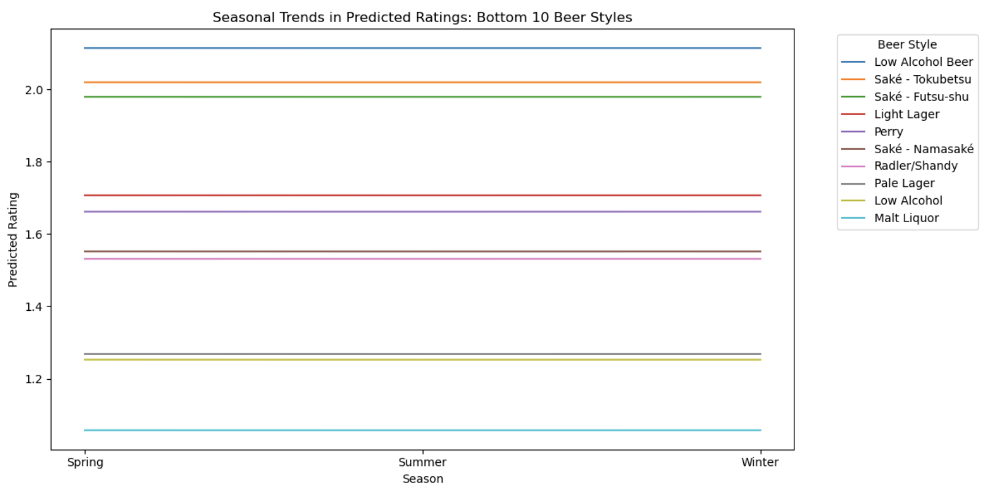

# Selective sips: cultural and bias trends in beer preferences across countries
## _by DataPilots_

##  Introduction
### Goal of the analysis
Taste preferences for food and drinks often go beyond the intrinsic characteristics of the items themselves and are in reality shaped by various external influences. Cultural differences are a prime example: while highly spiced dishes are popular in many South Asian countries, milder flavors are often preferred in Western Europe. This project examines similar external factors that shape beer preferences, aiming to uncover what truly drives an individual’s taste in beers. We analyze how different beer characteristics are appreciated across selected countries and assess whether the origin of a beer biases the ratings it receives. Additionally, we investigate how seasonal variations and user experience impact the enjoyment of specific beer categories. By identifying these “external” influences, we hope to help beer enthusiasts better understand their preferences and make choices based more on intrinsic qualities, ultimately improving their sensory experience and enjoyment of beer.

### Dataset
The dataset for this analysis comprises beer reviews collected from two popular beer rating platforms, BeerAdvocate and RateBeer, covering a period from 2001 to 2017. For each website, the dataset includes metadata on reviewers, beers, and breweries, along with detailed user reviews. In total, there are records of over 500,000 unique beers produced by breweries in more than 200 countries. Among the most frequently reviewed beer styles are American IPA and India Pale Ale. The dataset also includes approximately 200,000 users from over 200 countries, though the distribution of users and breweries is heavily skewed: the vast majority are located in the United States on both platforms. Overall, the dataset contains over 8 million reviews from BeerAdvocate and 7 million from RateBeer. For the parts of our analysis that involve country comparisons, we excluded reviews from countries with fewer than 50 reviewers to ensure that the data is representative at a national level.

##  Analysis
Content of the analysis

### Seasonal biases
In this part, we examined how seasonal changes may influence beer ratings. To do so, we used the time information to determine the season during which each rating was posted.  To analyze whether the season in which a beer is reviewed has a significant impact on its rating, we first performed linear regression to adjust for confounding factors. Then we examined seasonal coefficients to determine statistical significance. And we created visualizations to analyze predicted ratings for each beer style across seasons.

####Regression Analysis

For the Regression Model we used variables below: 

Dependent Variable: Final Beer Rating
Independent Variables:
Season (Spring, Summer, Winter)
Beer Style (categorical interaction with season)
ABV (Alcohol By Volume)
User's Average Rating
Brewery's Average Rating
Style's Average Rating

The dominant predictors of beer ratings are the Brewery Average Rating, which has the highest coefficient and exerts the strongest influence, followed by User Average Rating and Style Average Rating, both of which make significant but smaller contributions. The ABV (Alcohol By Volume) also has a small but positive effect. In contrast, the seasonal coefficients for Spring (+0.0013), Summer (-0.0035), and Winter (-0.0006) are very close to zero, indicating that seasonal effects, while statistically significant, are minimal. Overall, user and brewery averages dominate beer ratings, with seasonal variations having a negligible practical impact.

####Predicted ratings across seasons 
Using the regression coefficients, we calculated predicted ratings for each beer style in Spring, Summer, and Winter. The average predicted ratings were as follows:

Season |	Average Predicted Rating
Spring |	4.058
Summer |	4.054
Winter |	4.057

We concluded from the data that the average ratings remain consistent across seasons.
Seasonal changes have a negligible effect on the predicted ratings. The bar chart below illustrates the minimal difference in average ratings across Spring, Summer, and Winter.

####Seasonal Trends by Beer Style 

To see the seasonal trends by beer style we plotted a heatmap for beer styles across seasons. 

ın the heatmap, we observe that most beer styles show little color variations accross seasons. We understand that the predicted ratings for the beer styles are the same regardless of the season. The season has small effect on the predicted ratings. We conclude that the seasonal changes have small but statistically significant effect on predicted ratings.

Top 10 Beer Styles
The line plot for the top-rated beer styles shows subtle fluctuations across seasons. Predicted ratings for styles like American Double/Imperial Stout and Quadruple (Quad) remain consistently high with minimal variation.

For example we got ratings American Double/Imperial Stout: 4.85 → 4.84 → 4.85 and for Gueuze: 4.78 → 4.78 → 4.78. Therefore, we conclude that for the highest-rated beer styles, ratings are consistent regardless of the season.

Bottom 10 Beer Styles
The line plot for the lowest-rated beers (e.g., Light Lager, Pale Lager, and Malt Liquor) similarly shows minimal seasonal impact.

For example, we got ratings for beer style Light Lager: 3.29 → 3.28 → 3.29. 
We also confirm that seasonal bias is negligible across both highly rated and poorly rated beer styles.

####Distribution of Seasonal Variation

To understand the range of seasonal variations, we calculated the maximum-minimum difference for predicted ratings across seasons. We observed that most beer styles have a rating range of 0.004-0.005 which indicates very little variation across seasons. The histogram below shows a concentrated distribution, and we can see the negligible seasonal impact of season on beer preferences.

####Conclusion 

### Experience biases
The last part of our analysis consisted in assessing the influence of user experience on beer ratings. It is well known that taste develops and refines over time. A good example is wine palate evolution: many young people initially dislike wine or prefer cheaper varieties, but they progressively develop a preference for older, high-quality wines as they age. We decided to investigate whether this phenomenon of palate refinement also occurs in beer ethusiasts. 

##  Conclusion
Content of the conclusion
