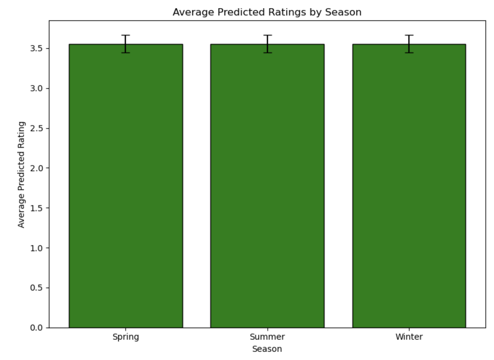
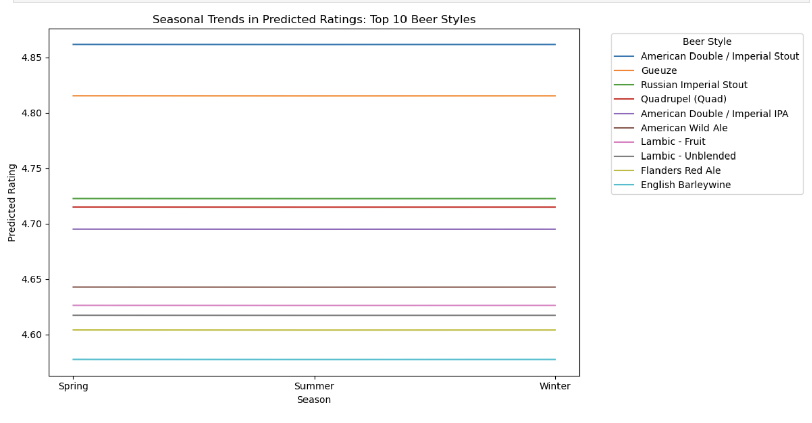

# Selective Sips: Cultural and Bias Trends in Beer Preferences Across Countries
## _by DataPilots_

##  Introduction
### Goal of the analysis
Taste preferences for food and drinks often go beyond the intrinsic characteristics of the items themselves and are in reality shaped by various external influences. Cultural differences are a prime example: while highly spiced dishes are popular in many South Asian countries, milder flavors are often preferred in Western Europe. Our project examined similar external factors that shape beer preferences, aiming to uncover what truly drives an individual’s taste in beers. We analyzed how different beer characteristics are appreciated across selected countries and assessed whether users from certain countries are more generous in their ratings compared to users from other countries. We also evaluateed whether the origin of a beer biases the ratings it receives. Additionally, we investigated how seasonal variations impact the enjoyment of specific beer categories, and how user rating tendencies evolve as they gain experience. By identifying these “external” influences, we hoped to help beer enthusiasts better understand their preferences and make choices based more on intrinsic qualities, ultimately improving their sensory experience and enjoyment of beer.

### Dataset
The dataset for our analysis comprised beer reviews collected from two popular beer rating platforms, BeerAdvocate and RateBeer, covering a period from 2001 to 2017. For each website, the dataset included metadata on reviewers, beers, and breweries, along with detailed user reviews. In total, there were records of over 500,000 unique beers produced by breweries in more than 200 countries. Among the most frequently reviewed beer styles were American IPA and India Pale Ale. The dataset also included approximately 200,000 users from over 200 countries, though the distribution of users and breweries was heavily skewed: the vast majority were located in the United States on both platforms. Overall, the dataset contained over 8 million reviews from BeerAdvocate and 7 million from RateBeer. For the parts of our analysis that involved country comparisons, we excluded reviews from countries with fewer than 50 reviewers to ensure that the data was representative at a national level.

##  Cultural influence on beer preferences
### Beer style preferences
TO DO

### Importance of specific beer attributes
TO DO

##  Location-related biases in ratings
After exploring how beer preferences differ across countries, we aimed to identify factors—beyond the intrinsic qualities of beer—that might influence user ratings. Our initial focus was on location-related biases, as these seemed the most likely to impact beer ratings.

### Cultural biases
Our first step was to investigate whether users from certain countries are more generous or more critical in their ratings compared to users from other countries. 

#### **Logistic regression**
To this aim, we started by fitting a logistic regression model on reviews from BeerAdvocate and RateBeer (combined in a single dataset),where the dependent variable was the reviewer’s country, and the independent variables were potentially relevant confounders, namely the average rating for the beer style, the brewery's average rating and the number of reviews given by the user. The model gave a propensity score to each review, which corresponded to the likelihood of a review being associated with a particular country given the confounders.
 
We used these propensity scores to match individual reviews from reviewers in one country with reviews from reviewers in another country that have similar propensity scores. This matching ensured that the paired reviews were comparable in terms of confounders, so that any differences in ratings could be attributable to the reviewer’s country rather than other factors. 

#### **Paired analysis**
To be able to determine whether users from certain countries are more generous or more critical in their ratings compared to users from other countries, we compared paired rating differences between all pairs of user location. To do so, we grouped the matched reviews by country pairs and performed a paired t-test for each group to test whether the mean difference in ratings was significantly different from zero. We only considered country pairs with at least 10 matched reviews. We then plotted the obtained p_values for each country pair to see if there were some significant differences in final beer ratings for some country pairs at a 5% significance level. The results are shown in the plot below.

As shown by all the black dots above the y=0.05 line, the majority of tests yielded a p-value larger than 0.05, meaning that for most country pairs, the mean difference in final rating was not significant at a 5% significance level. However, there are several country pairs for which there actually was a significant difference in final rating. For instance, we can see in the plot that after accounting for confounders, users from Croatia tend to give ratings that are significantly lower than users from Singapore from a statistical standpoint. On the other hand, users from Argentina tend to give ratings that are significantly higher than users from South Africa from a statistical standpoint. These results suggested that users from certain regions tend to be more generous or more critical in their ratings compared to users from other countries.

In this way, some of the differences were statistically significant. However, statisticals significance does not imply practical significance. In order to determine if these differences were also meaningful from a practical standpoint, we decided to look at their magnitude. We plotted a boxplot to visualize the distribution of differences in final beer rating between matched reviews for the 10 country pairs for which the t-test yielded the lowest p-values. We obtained the figure below.

In the plot, none of the boxes contain zero (zero is not comprised between Q1 and Q3), which indicates that for each of the top 10 country pairs with the lowest p-values, ratings from one country are consistently higher or lower than those from the other country for most paired reviews in the sample. This implies that the majority of matched reviews for each of these country pairs show a meaningful and unidirectional difference in ratings. In addition, the median for nearly all country pairs in the plot is larger than 1 in absolute value. A difference of 1 out of 5 is large, which means that for these country pairs, the differences in ratings are not only statistically significant but also meaningful from a practical standpoint.

These results suggested that after accounting for potential confounders, users from certain countries are more generous in their ratings compared to users from other countries. There seemed to be clear trends in rating differences for certain country pairs, and the differences in ratings appeared significant from both a statistical and a practical standpoint. We concluded that there seemed to be a "cultural bias" among beer reviewers, which can have a meaningful impact on beer reviews.

### Beer origin bias
TO DO

##  Other biases
After examining cultural and origin-based biases in beer ratings, we turned our attention to other external factors unrelated to location. Using the time data available in reviews, we analyzed two such factors: the season during which the beer was reviewed and the user’s experience level.

### Seasonal biases
We first decided to investigate how seasonal changes influence beer ratings. We started by using the time information contained in ratings to identify the season during which each rating was posted, taking into account the location of the user (Northern hemisphere, Southern hemisphere or equatorial area) to accurately determine the season. For simplicity, we only performed the analysis on users from the 10 countries with the highest number of reviews. 

We first performed a linear regression analysis with the final rating as the dependent variable and key predictors, namely season, average rating for the beer style, average rating for the brewery, user’s average rating, ABV, appearance, aroma, palate, taste as the independent variables. We examined the regression coefficients for the season variable to see whether ratings were significantly higher or lower in certain seasons after accounting for confounders. Using these coefficients, we then calculated predicted ratings for each beer style in each season and visualized the results with line charts, showing seasonal trends for different beer styles. 

#### **Regression Analysis**

For the Linear regression model, we used the variables below: 

- **Dependent Variable**: Final Beer Rating  
- **Independent Variables**:  
   - Season (Spring, Summer, Winter)  
   - ABV (Alcohol By Volume)  
   - User's Average Rating  
   - Brewery's Average Rating  
   - Style's Average Rating
   - Appearance
   - Aroma
   - Palate
   - Taste

From the regression, we got the following coefficients for each variable: 

|**Feature**         | **Coefficient**|
|----------------------|-------------|
| abv                  | 0.074121     |
| user_avg_rating      | 0.137794     |
| brewery_avg_rating   | 0.275858     |
| style_avg_rating     | 0.123048     |
| season_Spring        | 0.001250     |
| season_Summer        | -0.003523    |
| season_Winter        | -0.000628    |

From the results, we found that the main predictors of beer ratings were the **Brewery Average Rating**, which had the strongest influence, followed by **User Average Rating** and **Style Average Rating**, which also had significant but smaller effects. The **ABV (Alcohol By Volume)** had a small but positive effect. The seasonal coefficients for **Spring (+0.0013)**, **Summer (-0.0035)**, and **Winter (-0.0006)** were very much smaller to the other coefficients, suggesting that seasonal effects, while statistically significant, were minimal. We concluded that seasonal variations had a minor impact on beer ratings compared to other factors such as user and brewery average ratings.

#### **Predicted ratings across seasons**

Using the regression coefficients, we calculated predicted ratings for each beer style in Spring, Summer, and Winter. The average predicted ratings were as follows:

| **Season** | **Average Predicted Rating** |
|------------|-----------------------------|
| Spring     | 4.058                       |
| Summer     | 4.054                       |
| Winter     | 4.057                       |

We concluded from the data that the average ratings remain consistent across seasons. The bar chart below illustrates the minimal difference in average ratings across Spring, Summer, and Winter. These results were expected from the small values of the season coefficients in the linear regression model.

#### **Seasonal Trends by Beer Style**

To visualize the variations of predicted average rating across seasons for different beer styles, we plotted a heatmap.

In the heatmap below, we observe that most beer styles show little color variations across seasons. This suggests that the predicted rating for a given beer style is the same regardless of the season. 

##### *Top 10 Beer Styles by average predicted rating*

For a more fine-grained analysis, we decided to look at the seasonal variations of several subsets of beer styles. First, we considered the 10 beer styles with the highest average predicted rating by the model.

The line plot for the top-rated beer styles shows subtle fluctuations across seasons. Predicted ratings for styles like American Double/Imperial Stout and Quadruple (Quad) remain consistently high with minimal variation.

For instance, the predicted ratings for American Double/Imperial Stout are 4.85 in the spring, 4.84 in summer and 4.85 in winter. We concluded from these results that for the highest-rated beer styles, ratings are consistent regardless of the season.

##### *Bottom 10 Beer Styles by average predicted rating*

The line plot for the lowest-rated beers (e.g., Light Lager, Pale Lager, and Malt Liquor) based on predicted ratings similarly shows minimal seasonal impact.

For instance, the predicted ratings for Light Lager are 3.29 in the spring, 3.28 in summer and 3.29 in winter. Just like for the top-rated beer styles, the season appeared to have a negligible influence on the ratings of poorly-rated beer styles.

#### **Distribution of Seasonal Variation**

In order to have an idea of the distribution of the seasonal variations of predicted ratings across beer styles, we calculated the maximum-minimum difference for predicted ratings across seasons for the different beer styles and showed the distribution of the results using a histogram. We observed that most beer styles have a rating range of 0.004-0.005 which indicates very little variation across seasons. 

#### **Conclusion on Seasonal Biases**
In conclusion, we found that seasonal variations did not appear to have a practically significant impact on beer ratings. Other factors such as user and brewery average ratings seemed to play a much larger role in determining the beer ratings.

### Experience bias
The last part of our analysis consisted in assessing the influence of user experience on beer ratings. It is well known that taste develops and refines over time. A good example is wine palate evolution: many young people initially dislike wine or prefer cheaper varieties, but they progressively develop a preference for older, high-quality wines as they age. We decided to investigate whether this phenomenon of palate refinement also occurs in beer ethusiasts. 

For this analysis, we decided to focus on users who posted a substantial number of reviews, based on a chosen threshold, and worked on the BeerAdvocate and RateBeer datasets separately. We started by sorting the reviews from each selected user chronologically and assigning an "experience level" to each review based on the number of reviews the user had posted up to that point. These levels were predefined and consistent across all users: new reviewer (first n reviews), amateur (from the n+1th to the oth review), and expert (from the o+1th review onward). 

#### **Linear regression**
To compare rating tendencies across all users, we fitted a linear regression model on ratings to quantify the effect of experience levels on ratings while adjusting for potential confounders. The dependent variable was the final rating of the beer, and the key independent variable was the experience level of the user when they wrote the review. We also included additional independent variables corresponding to potential confounders, namely the average rating for the corresponding beer style, the average rating for the corresponding brewery and the average rating for the corresponding user. We then analyzed the regression coefficients, which are shown in the plots below.

In both plots, each bar corresponds to a regression coefficient:
- x1: average rating for the beer style
- x2: average rating given by the user
- x3: average rating for beers of the brewery
- x4: expert experience level
- x5: new reviewer experience level.

In both cases (BeerAdvocate and RateBeer), the p-values of all coefficients, including those corresponding to user experience levels (x4 and x5) were extremely small, implying that the chosen features were useful in explaining variations in the final rating. As shown in the plots, the coefficients corresponding to user experience levels were much smaller than the other coefficients, meaning that though they were useful in explaining variations in the final rating, they had a much smaller effect on the final rating than the average rating of the beer style, the average rating of the brewery and average rating given by the user. In both cases, the coefficient corresponding to the expert experience level (x4) was negative, implying that being an expert reviewer is associated with lower final ratings. On the other hand, in both cases, the coefficient corresponding to the new reviewer experience level (x5) was positive, implying that being a new reviewer is associated with higher final ratings.

In this way, the linear regression analysis on both datasets suggested that user experience levels significantly influence the final rating, as indicated by their small p-values. However, their effect size appeared to be smaller compared to factors like beer style, brewery average rating, and user average rating. The results seemed to indicate that new reviewers are more generous, while expert reviewers are more critical, leading to lower ratings, but that the overall influence of experience level on the final rating was relatively subtle.

#### **Paired analysis**
We then decided to examine how ratings change within *individual* users  as they gain experience. To achieve this, we performed a paired analysis by matching reviews labeled as “new reviewer” and “expert” within each user. Comparing reviews from the same user allowed us to control for confounding factors related to user-specific characteristics. To further isolate the effect of experience on ratings, we also matched reviews based on beer style and brewery, as we thought they might be confounders. We then performed a one-tailed paired t-test to determine if ratings given by a user when they are a new reviewer are higher than those they give when they are an expert, as suggested by the previous results.

The one-tailed paired t-tests performed on both datasets yielded a positive test statistic and a very small p-value. This indicated that on average, the final rating given by a specific user to beers from the same brewery and with the same style is higher when the user is a new reviewer than when they have become an expert reviewer. These findings aligned with the results of the linear regression, which suggested that new reviewers are more generous, while expert reviewers are more critical.

The t-tests allowed us to evaluate the statistical significance of the mean difference in ratings between matched reviews. However, as explained in the part examining cultural biases in ratings, statisticals significance does not imply practical significance. In order to determine if the differences in ratings between matched reviews were also meaningful from a practical standpoint, we decided to plot a boxplot to get a better idea of their magnitude and distribution. We obtained the figure below. Differences within pairs of reviews were calculated as the rating of the review corresponding to an "expert" experience level minus the rating of the review corresponding to a "new reviewer" experience level.

As shown in the plot, for both datasets, the mean difference was negative but very small and close to zero. In addition, there were many paired reviews where the expert review was associated with a much lower final rating than the paired new reviewer review, as shown by the numerous data points with a large negative value for the difference. However, there were also some cases where the expert review had a much higher rating than the paired new reviewer review, leading to high positive values.

The t-tests that we had performed had detected a statistically significant difference, showing that new reviewers tend to give slightly higher ratings than expert reviewers on average. The boxplots showed that the mean difference in final rating between matched reviews was actually close to zero in practical terms, with many extreme positive and negative differences balancing each other out. They revealed the high variability and the presence of outliers in rating differences between matched reviews, which are aspects that were not captured by the t-tests. 

These results illustrated the difference between statistical and practical significance: while the t-tests demonstrated a statistically significant difference (probably because of the large sample size, which could make even small differences statistically significant), the actual effect size (difference in final ratings between matched reviews) was small and not practically meaningful. New reviewers appear to be slightly more generous than experts on average, but the difference is minimal and likely negligible in practical terms.

In this way, both analyses the linear regression and the paired analysis found that user experience level influences ratings, with more experienced users being slightly more critical. However, the effect appeared statistically significant but numerically small, suggesting that experience level has a minor impact on ratings compared to other factors like beer style, brewery reputation, and user generosity.

##  Conclusion
Content of the conclusion
